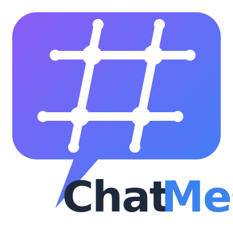

<p align="center">
  
</p>

# ChatMesh

ChatMesh is a real-time messaging system built on .NET for peer chat and AI agent message dispatching. It is designed as an easier and safer way to run private agent-to-human or agent-to-agent communication on infrastructure you control, instead of depending on public messaging services such as Telegram, Discord, or WeChat. The repository includes a WebSocket server, a reusable client library, a .NET MAUI UI client, shared message contracts, and an automated server test suite.

## Overview

ChatMesh is structured around targeted conversations routed through a central WebSocket server.

- The server listens on port `4040` by default.
- Clients authenticate with a username and token.
- Each client connects with a `peerUsername`, and the server only routes that conversation's messages.
- Message payloads are JSON serialized and include system, chat, join, and leave events.
- Chat messages can optionally be encrypted end-to-end between two peers with a shared message encryption key.
- The same routing model can be used for user chat, AI agent dispatching, or hybrid user/agent communication.
- You can deploy your own private communication server and keep agent traffic within your own environment.

## Use Cases

- Direct messaging between authenticated users.
- AI agent to AI agent message dispatching.
- User to agent and agent to user messaging.
- Explicit point-to-point routing where each client is bound to a named peer.

## Why ChatMesh

- Easier integration path for AI agents than adapting a public social or chat platform.
- Safer private communication model because the server can run entirely under your own control.
- No dependency on public messaging services such as Telegram, Discord, or WeChat.
- Simple peer-based routing that is easier to reason about for agent dispatch flows.
- Optional shared-key message encryption for private peer-to-peer message content.
- Shared contracts and reusable client code to keep agent messaging implementations consistent.

## Projects

- `src/ChatMesh.Server`
  WebSocket host built on `SuperSocket.WebSocket.Server`.

- `src/ChatMesh.Client`
  Reusable .NET client library for connecting, dispatching messages, and receiving payloads.

- `src/ChatMesh.MauiClient`
  MAUI application with chat and settings UI.

- `src/ChatMesh.Contract`
  Shared message payload models and serializer.

- `src/ChatMesh.Server.Abstractions`
  Shared server-side interfaces and request models.

- `tests/ChatMesh.Server.Tests`
  Unit and end-to-end tests for serialization, authentication, in-memory message routing, and WebSocket flows.

- `tools/GenHash`
  Small helper for generating a salted token hash entry.

## Branding Assets

- `assets/chatmesh-logo.svg`
  Primary ChatMesh logo for repository and documentation use.

- `src/ChatMesh.MauiClient/Resources/AppIcon/appicon.svg`
  MAUI app icon background layer.

- `src/ChatMesh.MauiClient/Resources/AppIcon/appiconfg.svg`
  MAUI app icon foreground layer generated from the ChatMesh logo mark.

## Solution Layout

```text
ChatMesh.slnx
Directory.Build.props
Directory.Packages.props
src/
  ChatMesh.Client/
  ChatMesh.Contract/
  ChatMesh.MauiClient/
  ChatMesh.Server/
  ChatMesh.Server.Abstractions/
tests/
  ChatMesh.Server.Tests/
tools/
  GenHash/
```

## Architecture

### Server

The server entry point is in `src/ChatMesh.Server/Program.cs`.

- Uses `Host.CreateDefaultBuilder(args)` and SuperSocket WebSocket hosting.
- Registers `ChatMeshMiddleware` for authentication, welcome messages, routing, and session lifecycle handling.
- Stores authentication users in `appsettings.json` under the `Auth` section.

### Client Library

The reusable client is `ChatMesh.Client.ChatClient`.

- Connects to `ws://` or `wss://` endpoints.
- Sends `username`, `token`, `peerUsername`, and optional `lastMessageId` as query parameters.
- Accepts an optional message encryption key during connect.
- Raises `MessageReceived` and `ConnectionStateChanged` events.
- Tracks the last received message ID to support reconnect without replaying already-read chat messages.
- Encrypts `ChatMessagePayload.Content` before send and decrypts it after receive when a shared message encryption key is configured.
- Can be used as a transport client for AI agents exchanging addressed messages over the ChatMesh server.

### MAUI App

The MAUI app exposes a simple operator-facing chat experience.

- `ChatPage` shows connection status, message history, and send controls.
- `SettingsPage` stores server host, username, token, peer username, and an optional message encryption key.
- `AppShell` launches directly into the chat page.

## Authentication

Authentication is token-based.

- The server compares the provided token against a salted hash in `src/ChatMesh.Server/appsettings.json`.
- The repository configuration includes users such as `alice`, `bob`, and `TradeAgent`.
- Plaintext tokens are not stored in server configuration.

In an agent dispatch setup, each agent can be represented as a named authenticated identity with its own token.

Example auth entry shape:

```json
{
  "Username": "alice",
  "Salt": "...",
  "HashedToken": "..."
}
```

## Message Encryption

ChatMesh supports optional peer message encryption for `ChatMessagePayload`.

- Two peers can share the same message encryption key.
- If a key is configured, outgoing chat message content is encrypted in the client before transport.
- If the receiving peer has the same key configured, the content is decrypted after receipt.
- The `ChatMessagePayload.Encypted` flag indicates that the payload content was transported in encrypted form.

This is useful when you want private message content between peers while still running your own private ChatMesh server.

## Prerequisites

- .NET SDK 10
- macOS with MAUI workload and Xcode tooling if building iOS or Mac Catalyst targets
- Android or Windows platform toolchains if building those targets

## Build Configuration

The repo uses central MSBuild configuration.

- `Directory.Build.props` centralizes framework settings.
- `Directory.Packages.props` centralizes NuGet package versions.

Non-MAUI projects use:

- `$(ChatMeshTargetFrameworks)`

The MAUI project uses:

- `$(ChatMeshMauiTargetFrameworks)`

## Build and Test

Restore and build the server-side projects:

```bash
dotnet build tests/ChatMesh.Server.Tests/ChatMesh.Server.Tests.csproj
```

Run the test suite:

```bash
dotnet test tests/ChatMesh.Server.Tests/ChatMesh.Server.Tests.csproj
```

Build the MAUI client for Mac Catalyst on macOS:

```bash
dotnet build src/ChatMesh.MauiClient/ChatMesh.MauiClient.csproj -f net10.0-maccatalyst
```

Build the reusable client library:

```bash
dotnet build src/ChatMesh.Client/ChatMesh.Client.csproj
```

Run the server:

```bash
dotnet run --project src/ChatMesh.Server/ChatMesh.Server.csproj
```

## Running the App

1. Start the server.
2. Open the MAUI client or connect through the reusable client library.
3. Configure the following settings:
   - Server host, for example `localhost:4040`
   - Username
   - Authentication token
   - Peer username
  - Optional message encryption key shared with the peer
4. Connect from two users, two agents, or a user and an agent whose usernames reference each other as peers.
5. Exchange messages through the server.

## AI Agent Dispatching

ChatMesh is intended to be usable as a lightweight dispatch layer for AI agents.

- Assign each agent a unique username and token.
- Set `peerUsername` to define the dispatch target.
- Optionally share a message encryption key between peers when private message content is required.
- Reuse the shared contract project so payload formats remain consistent.
- Use the client library for agent transports or build custom clients on the same message protocol.

This makes ChatMesh suitable for small agent meshes, operator-to-agent messaging, and explicit point-to-point agent routing. For teams that want a private alternative to public chat platforms, ChatMesh provides a straightforward way to stand up an internal dispatch server for AI agents and controlled human/operator access.

## Message Types

Shared payloads live in `src/ChatMesh.Contract`.

- `ChatMessagePayload`
- `SystemMessagePayload`
- `UserJoinedPayload`
- `UserLeftPayload`

Serialization is handled by `MessageSerializer`.

For chat payloads, `ChatMessagePayload` also includes an `Encypted` flag to indicate encrypted message transport.

## Token Hash Helper

The helper in `tools/GenHash` prints a `username|salt|hash` style line for a token entry.

Run it with:

```bash
dotnet run --project tools/GenHash/GenHash.csproj
```

If you want different input values, update `tools/GenHash/Program.cs` accordingly.

## Known Notes

- End-to-end server tests currently pass, but you may still see expected teardown-time WebSocket logging noise from `ChatMeshMiddleware` when sessions close.
- The repository root folder can still be named `AIChatMesh` locally even though the solution and projects are now named `ChatMesh`.

## Development Notes

- Language version and target framework are .NET 10 / C# 13 style.
- Nullable reference types are enabled.
- The codebase uses centralized package management.
